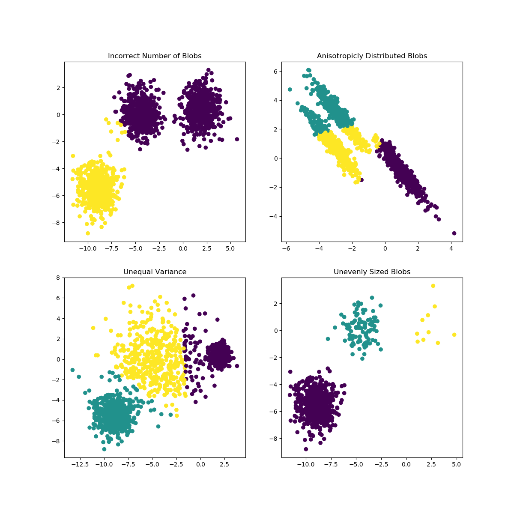
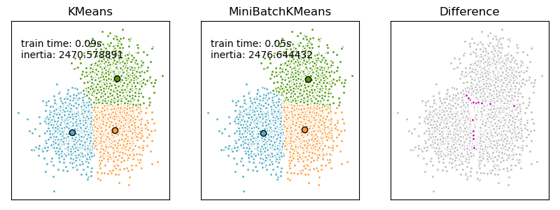

# k-means Clustering

* Supervisor: Thorsten Beier ([thorsten.beier@embl.de](mailto:thorsten.beier@embl.de))
* Tutor: Alexander Mattausch ([a.mattausch@stud.uni-heidelberg.de](a.mattausch@stud.uni-heidelberg.de))


The k-means algorithm is one of the most popular clustering algorithms.
It is an important building block for bioinformatics and image analysis.
While the  k-means algorithm is fast enough for small to medium sized datasets, the runtime becomes a problem for large datasets.
In this project you will implement a scalable alternative to the classical k-means algorithm, namely the **Mini Batch k-means algorithm**.

## k-means
The k-means algorithm clusters data by trying to separate samples in *n* groups of equal variance, minimizing a criterion known as the inertia or within-cluster sum-of-squares. This algorithm requires the number of clusters to be specified. It scales well to large number of samples and has been used across a large range of application areas in many different fields.

The k-means algorithm divides a set of *N*
samples *X* into *K* disjoint clusters *C*, each described by the mean $\mu_j$ of the samples in the cluster. The means are commonly called the cluster “centroids”; note that they are not, in general, points from *X*, although they live in the same space. The k-means algorithm aims to choose centroids that minimise the inertia, or within-cluster sum of squared criterion:


$\sum_{i=0}^{n}\min_{\mu_j \in C}(||x_i - \mu_j||^2)$


Inertia, or the within-cluster sum of squares criterion, can be recognized as a measure of how internally coherent clusters are. It suffers from various drawbacks:

 - Inertia makes the assumption that clusters are convex and isotropic, which is not always the case. It responds poorly to elongated clusters, or manifolds with irregular shapes.
 - Inertia is not a normalized metric: we just know that lower values are better and zero is optimal. But in very high-dimensional spaces, Euclidean distances tend to become inflated (this is an instance of the so-called “curse of dimensionality”). Running a dimensionality reduction algorithm such as principal-component analysis (PCA) prior to k-means clustering can alleviate this problem and speed up the computations.
 


k-means is often referred to as Lloyd’s algorithm. In basic terms, the algorithm has three steps. 

1. The first step chooses the initial centroids, with the most basic method being to choose $k$ samples from the dataset $X$. After initialization, k-means consists of looping between the two other steps. The first step assigns each sample to its nearest centroid. 
2. The second step creates new centroids by taking the mean value of all of the samples assigned to each previous centroid. 
3. The difference between the old and the new centroids are computed and the algorithm repeats these last two steps until this value is less than a threshold. In other words, it repeats until the centroids do not move significantly.


The algorithm can also be understood through the concept of Voronoi diagrams. First the Voronoi diagram of the points is calculated using the current centroids. Each segment in the Voronoi diagram becomes a separate cluster. Secondly, the centroids are updated to the mean of each segment. The algorithm then repeats this until a stopping criterion is fulfilled. Usually, the algorithm stops when the relative decrease in the objective function between iterations is less than the given tolerance value. 

Given enough time, k-means will always converge, however this may be to a local minimum. This is highly dependent on the initialization of the centroids. As a result, the computation is often done several times, with different initializations of the centroids. One method to help address this issue is the **k-means++** initialization scheme. This initializes the centroids to be (generally) distant from each other, leading to provably better results than random initialization, as shown in the reference.

(taken from https://scikit-learn.org/stable/modules/clustering.html#k-means)

## Mini Batch k-means:
The Mini Batch k-means is a variant of the k-means algorithm which uses mini-batches to reduce the computation time, while still attempting to optimise the same objective function. Mini-batches are subsets of the input data, randomly sampled in each training iteration. These mini-batches drastically reduce the amount of computation required to converge to a local solution. In contrast to other algorithms that reduce the convergence time of k-means, mini-batch k-means produces results that are generally only slightly worse than the standard algorithm.

The algorithm iterates between two major steps, similar to vanilla k-means. 

1. In the first step, samples are drawn randomly from the dataset, to form a mini-batch. These are then assigned to the nearest centroid. 
2. In the second step, the centroids are updated. In contrast to k-means, this is done on a per-sample basis. For each sample in the mini-batch, the assigned centroid is updated by taking the streaming average of the sample and all previous samples assigned to that centroid. This has the effect of decreasing the rate of change for a centroid over time. These steps are performed until convergence or a predetermined number of iterations is reached.

Mini Batch k-means converges faster than k-means, but the quality of the results is reduced. In practice this difference in quality can be quite small, as shown in the example.
(taken from https://scikit-learn.org/stable/modules/clustering.html#mini-batch-kmeans)




# Tasks:

Implement the following algorithms in python using the numpy library:
 - implement k-means:
    - compare your implementation with the sklearn implementation with respect to quality and speed
 - implement mini-batch k-means:
      - compare your implementation with the sklearn implementation with respect to quality and speed
 - implement k-means++ initialization:
 - Compare the runtime and quality of your k-means implementation  and your mini batch k-means implementation for different datasets. You can use code from sklearn to generate datasets of arbitrary size and difficulty (https://scikit-learn.org/stable/auto_examples/cluster/plot_cluster_comparison.html#sphx-glr-auto-examples-cluster-plot-cluster-comparison-py).
 You should generate multiple plots to visualize the comparison (eg. you can plot the runtinme / cluster quality for different dataset sizes / number of clusters)

- Cluster the `3K PBMCs from a Healthy Donor` Dataset  from 10x Genomics

On a unix system, you can download the dataset as follows:

```bash
mkdir data
wget http://cf.10xgenomics.com/samples/cell-exp/1.1.0/pbmc3k/pbmc3k_filtered_gene_bc_matrices.tar.gz -O data/pbmc3k_filtered_gene_bc_matrices.tar.gz
cd data; tar -xzf pbmc3k_filtered_gene_bc_matrices.tar.gz
```

- use scanpy to load the data ( see https://scanpy-tutorials.readthedocs.io/en/latest/pbmc3k.html)
- the code below can be used to convert the dataset to numpy dataset
- compare the performance of your implementations with the sklearn implementations 


```python
import scanpy as sc
import numpy

adata = sc.read_10x_mtx(
    './data/filtered_gene_bc_matrices/hg19/',  # the directory with the `.mtx` file
    var_names='gene_symbols',                  # use gene symbols for the variable names (variables-axis index)
    cache=True)   

x = adata._X.todense()
```

# Bonus Tasks Part 2:

Biologist prefer to do their data-analysis in a scripting language like R and python.
But to have fast algorithms in R and Python, some algorithms we use from R and python are are actually implemented in C/C++ to have maximum performance.
Framework like [xtensor](https://github.com/QuantStack/xtensor) make it possiblen to have a single C++ implementation which can be used from python via [xtensor-python](https://github.com/QuantStack/xtensor-python) and r via [xtensor-r](https://github.com/QuantStack/xtensor-r)

- implement mini-batch k-means: in C++ using  [xtensor](https://github.com/QuantStack/xtensor) 
- use [xtensor-python](https://github.com/QuantStack/xtensor-python) to write a python-wrapper which makes your c++ implementation usable from python
- use [xtensor-e](https://github.com/QuantStack/xtensor-e) to write a R-wrapper which makes your c++ implementation usable from R


# Papers to read

Papers to Read:
  - k-means++:  The Advantages of Careful Seeding http://ilpubs.stanford.edu:8090/778/1/2006-13.pdf
  - Web-Scale K-Means Clustering https://www.eecs.tufts.edu/~dsculley/papers/fastkmeans.pdf
    
